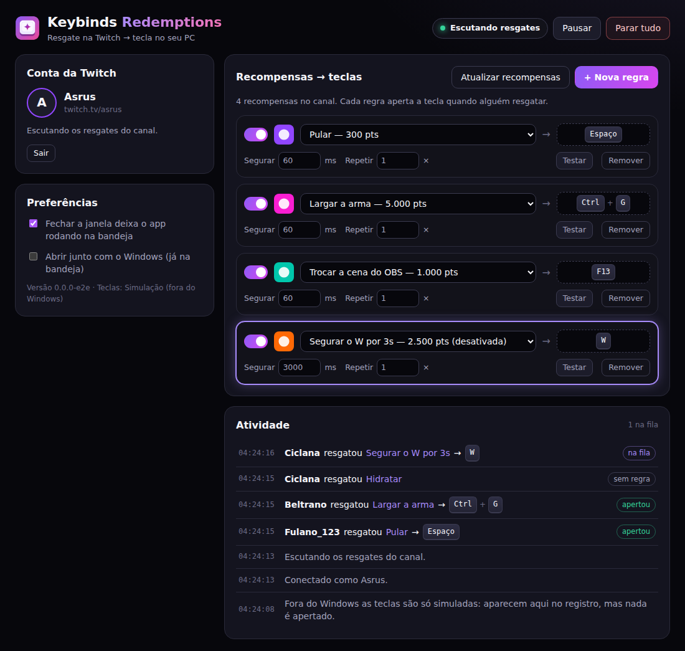

# Keybinds Redemptions

App para Windows que **aperta uma tecla no PC do streamer quando acontece algo na live**: resgate de recompensa de pontos do canal, bits, sub, gift sub ou doação em dinheiro.

Exemplos: o resgate “Pular” aperta Espaço no jogo; 1.000 bits ou mais aperta Ctrl+G; toda sub aperta F13 (que você liga a um atalho do OBS); uma doação de R$ 10 a R$ 49,99 aperta G, e uma de R$ 50 ou mais segura Shift+W por 3 segundos.



<sub>Print tirado no modo de simulação (fora do Windows). No Windows é a mesma tela, e as teclas são apertadas de verdade.</sub>

## Como funciona

1. O app entra na sua conta da Twitch (login por código, igual ao da TV).
2. Ele se conecta à **EventSub** da Twitch por WebSocket. Assim a Twitch avisa na hora de cada resgate, bits e sub, sem precisar de servidor nem de porta aberta no roteador.
3. As doações em dinheiro vêm do serviço que você usa (StreamElements, Streamlabs, LivePix ou PixGG), conectado com um token seu.
4. Quando chega um evento que bate com uma regra, o app aperta a tecla com a `SendInput` do Windows. A tecla vai para **a janela que estiver em foco**, normalmente o jogo.

As teclas são enviadas como **scancode**, a mesma coisa que o teclado físico manda. Por isso funcionam também em jogos que ignoram tecla “virtual” (DirectInput/Raw Input).

## Instalar

Baixe o instalador na aba **Actions** do repositório (último run verde → artefato `keybinds-redemptions-windows`) ou em **Releases**, se houver uma.

- `KeybindsRedemptions-Setup-x.y.z.exe`: instalador normal.
- `KeybindsRedemptions-Portable-x.y.z.exe`: roda sem instalar.

O executável não tem assinatura digital. Por isso, na primeira vez, o Windows SmartScreen avisa: clique em **Mais informações → Executar assim mesmo**.

## Primeira configuração (uma vez só)

### 1. Crie um app na Twitch

O app precisa de um **Client ID** seu. É de graça e leva um minuto:

O console da Twitch é em inglês; os nomes dos campos estão como aparecem lá.

1. Entre em [dev.twitch.tv/console/apps](https://dev.twitch.tv/console/apps/create) (**Register Your Application**).
2. **Name**: qualquer um (ex.: `keybinds-do-fulano`).
3. **OAuth Redirect URLs**: `http://localhost`. O app não usa esse endereço, mas o campo é obrigatório.
4. **Category**: *Broadcaster Suite*.
5. **Client Type**: **Public**. Isso é importante: com *Confidential* o app não consegue renovar a sessão sozinho.
6. Clique em **Create**, depois em **Manage**, e copie o **Client ID**.

### 2. Entre com a Twitch

1. Abra o app, cole o Client ID e clique em **Salvar**.
2. Clique em **Entrar com a Twitch**. O navegador abre em `twitch.tv/activate` com um código.
3. Confira se o código é o mesmo que aparece no app e clique em **Autorizar**.

O app só pede permissões de leitura: `channel:read:redemptions` (resgates e lista de recompensas), `bits:read` (bits) e `channel:read:subscriptions` (subs e gift subs). Ele não consegue mexer em nada no seu canal.

Quem usava a versão anterior (só recompensas) precisa **entrar de novo uma vez** para liberar bits e subs; o app avisa.

### 3. (Opcional) Conecte o serviço de doação

Só precisa se for usar regras de **Doação**. No cartão **Doações**, abra o serviço, cole o token e clique em **Conectar**:

| Serviço | O que colar | Onde achar |
| --- | --- | --- |
| StreamElements | JWT Token | streamelements.com → Account → Channels → **Show secrets** → JWT Token |
| Streamlabs | Socket API Token | streamlabs.com → Settings → API Settings → API Tokens → **Your Socket API Token** |
| LivePix | Client ID e Client Secret | livepix.gg → Configurações → Aplicações → criar uma aplicação com a permissão **messages:read** |
| PixGG | Client ID e Client Secret | pixgg.com → Aplicações → criar uma aplicação **só para este app** |

Dá para conectar mais de um ao mesmo tempo. No StreamElements, o botão **Emulate → Tip** do painel também dispara as regras, bom para testar.

A LivePix não tem conexão em tempo real aberta: o app consulta as doações novas **a cada 5 segundos**, então pode levar até isso para a tecla apertar.

**PixGG:** o PixGG só avisa de doação por webhook, que precisa de um endereço público na internet, e o seu PC não tem um. Por isso o aviso passa pelo **asrus.app**:

1. Ao conectar, o app cadastra sozinho a URL de webhook da sua aplicação do PixGG para `https://asrus.app/api/pixgg/relay/<código>`. O código é gerado a partir do seu Client Secret: é fixo, ninguém adivinha, e o segredo não sai do PC.
2. O asrus.app guarda o aviso por até 24 h, sem abrir.
3. O app busca os avisos novos a cada 3 segundos e confere a assinatura de cada um com o seu Client Secret. Aviso com assinatura errada é descartado.

Se o PixGG recusar o cadastro automático (em algumas contas a API responde `403 Forbidden`), o app continua escutando e mostra a URL no cartão com um botão **Copiar**. Cole essa URL em pixgg.com → Aplicações → sua aplicação → URL de webhook. A URL depende do Client Secret: gerou um secret novo, cole a URL nova.

Como o app troca a URL de webhook da aplicação, use uma aplicação do PixGG **só para ele**. Só doação paga (`donation.paid`) aperta tecla; Pix gerado e não pago é ignorado.

### 4. Crie as regras

1. Clique em **+ Nova regra**.
2. Escolha o tipo de evento:
   - **Recompensa**: escolha a recompensa na lista. A lista vem do seu canal; se criou uma recompensa agora, clique em **Atualizar recompensas**.
   - **Bits**: a partir de quantos bits (e, se quiser, até quantos).
   - **Sub**: sub nova ou renovada, de qualquer tier ou de um tier específico.
   - **Gift sub**: a partir de quantas subs dadas de presente de uma vez.
   - **Doação**: de qual valor até qual valor, e de qual serviço (ou de qualquer um).
3. Clique no campo da tecla e **aperte a tecla ou a combinação** (ex.: Ctrl + G). Ou escolha numa lista, que tem F13–F24, teclas de mídia, teclado numérico etc.
4. Ajuste se quiser:
   - **Segurar**: por quanto tempo a tecla fica apertada. 60 ms é um toque; 3000 ms segura por 3 segundos.
   - **Repetir** e **Intervalo**: aperta várias vezes seguidas.
5. Clique em **Testar**, volte para o jogo e espere 3 segundos: o app aperta a tecla.

**Faixas de valor.** Em bits, gift sub e doação, se mais de uma regra servir para o mesmo evento, vale só a de maior “a partir de”. Com uma regra de R$ 5+ e outra de R$ 10+, uma doação de R$ 12 aperta só a de R$ 10+. Assim dá para montar “quanto mais doar, maior o efeito” sem as regras se somarem.

Pontos de canal, bits e subs só existem em canais **Afiliados ou Parceiros**.

## No dia a dia

- **Pausar**: os eventos continuam aparecendo na atividade, mas nenhuma tecla é apertada. Bom para menus, cutscenes e pausas.
- **Parar tudo**: interrompe o que estiver rodando, esvazia a fila e **solta todas as teclas**. Use quando alguém resgatar “segurar W por 30 s” na hora errada.
- Os eventos entram numa **fila** e rodam um de cada vez, para dois “segura W” não se atropelarem.
- Fechar a janela deixa o app rodando **na bandeja**, perto do relógio. Para sair de vez, clique com o botão direito no ícone e escolha **Sair**. Pausar e Parar tudo também estão nesse menu.
- **Abrir junto com o Windows** já inicia o app na bandeja.
- **Versão nova:** o app confere no GitHub ao abrir e a cada 6 horas. Quando sai uma versão nova, aparece um aviso no topo com o botão **Baixar**. Ele não atualiza sozinho: você instala quando quiser, fora da live.

### Dica para o OBS

As teclas **F13 a F24** não existem no teclado comum, então nenhum jogo usa. Coloque uma delas como atalho de cena, fonte ou filtro no OBS (**Configurações → Teclas de atalho**) e faça a regra apertar essa tecla. A recompensa passa a controlar o OBS sem risco de apertar nada no jogo.

## Problemas comuns

| Sintoma | Causa e solução |
| --- | --- |
| A tecla não chega no jogo, mas funciona no Bloco de Notas | O jogo roda **como administrador**. O Windows não deixa um app comum mandar tecla para um app elevado. Abra o Keybinds Redemptions como administrador também. |
| A atividade mostra “falhou: O Windows bloqueou a tecla” | Mesmo caso de cima. |
| Funciona em tudo menos em um jogo específico | Alguns anticheats ignoram de propósito teclas simuladas. Não tem como contornar pelo app. Também vale conferir as regras do jogo sobre automação antes de usar em partida ranqueada. |
| A tecla foi para a janela errada | O app aperta na janela **em foco**. Deixe o jogo em foco. |
| “Só canais Afiliados ou Parceiros têm pontos do canal” | A Twitch só libera recompensas para Afiliados/Parceiros. |
| A doação chegou, mas a atividade diz “sem regra” | O valor ficou fora de todas as faixas, ou a regra está presa a outro serviço. A atividade mostra o valor e o serviço de cada doação. |
| O serviço de doação mostra “erro” | O token foi recusado (trocado, expirado ou colado errado). Clique em **Trocar token** e cole de novo. |
| O app pediu para entrar de novo | Aconteceu uma destas coisas: a autorização foi removida em Configurações → Conexões da Twitch, o Client ID mudou, ou o app ficou mais de 30 dias sem abrir (é o limite da sessão de app público). |

## Privacidade

- Os tokens da Twitch ficam em `%APPDATA%\Keybinds Redemptions\tokens.bin`, e os dos serviços de doação em `donations.bin`, **cifrados pelo Windows (DPAPI)**. Só o seu usuário do Windows consegue ler.
- As regras e as preferências ficam em `config.json`, na mesma pasta.
- Para saber se há versão nova, o app lê só o release mais recente em `api.github.com`, sem mandar dado nenhum.
- O app só se comunica com a Twitch (`id.twitch.tv`, `api.twitch.tv` e `eventsub.wss.twitch.tv`) e com os serviços de doação que você conectar (`realtime.streamelements.com`, `sockets.streamlabs.com`, `oauth.livepix.gg`, `api.livepix.gg`, `app.pixgg.com` e o repasse em `asrus.app`). Ele não envia nada para nenhum outro lugar.
- As mensagens que os viewers mandam (no resgate, no cheer ou na doação) são ignoradas. A tecla é escolhida só pelo tipo de evento e pelo valor, então ninguém do chat consegue fazer o app apertar outra coisa.

## Desenvolvimento

Precisa de Node.js 22+.

```sh
npm install
npm start          # abre o app (fora do Windows, as teclas são só simuladas)
npm test           # testes (node:test)
npm run dist       # gera o instalador e o portátil em dist/ (rodar no Windows)
```

O instalador é gerado pelo GitHub Actions (`.github/workflows/build.yml`) em todo push e PR. Para publicar uma Release:

1. Suba a versão no `package.json` e escreva as mudanças em `release-notes/v<versão>.md`.
2. Com isso na `main`, crie a tag de um destes jeitos:
   - pelo GitHub: **Actions → Build → Run workflow**, na `main`, com o campo **release** preenchido (ex.: `v0.2.0`). O workflow cria a tag e a Release;
   - pelo terminal: `git tag v0.2.0 && git push origin v0.2.0`.

A tag precisa bater com a versão do `package.json`, senão o workflow recusa.

Há duas formas de não precisar colar o Client ID na tela:

- **`twitchClientId` no `package.json`**: o instalador já sai configurado. Útil para distribuir o app para outros streamers com o seu app da Twitch.
- **Variável de ambiente `TWITCH_CLIENT_ID`**: tem prioridade sobre tudo. Útil em desenvolvimento.

### Estrutura

```
src/
  main/
    main.js            Electron: janela, bandeja e IPC
    controller.js      login, conexões, eventos → regras e fila (sem Electron; testável)
    runner.js          fila que aperta as teclas e sempre as solta no fim
    rules.js           formato, limites e escolha das regras de cada evento
    store.js           config.json + tokens cifrados
    keyboard/win32.js  SendInput via koffi (FFI), com scancodes
    twitch/auth.js     Device Code Flow, refresh, validate e revoke
    twitch/api.js      Helix (usuário, recompensas, inscrição na EventSub)
    twitch/eventsub.js WebSocket da EventSub: keepalive, reconnect, deduplicação
    donations/         StreamElements e Streamlabs (Socket.IO), LivePix (consulta à API), PixGG (webhook via asrus.app)
  shared/keys.js       tabela de teclas (KeyboardEvent.code → scancode)
  preload.js           ponte segura entre a tela e o processo principal
  renderer/            tela (HTML/CSS/JS, sem framework)
test/                  testes; inclui uma user32 falsa em C para testar a FFI no Linux
```
